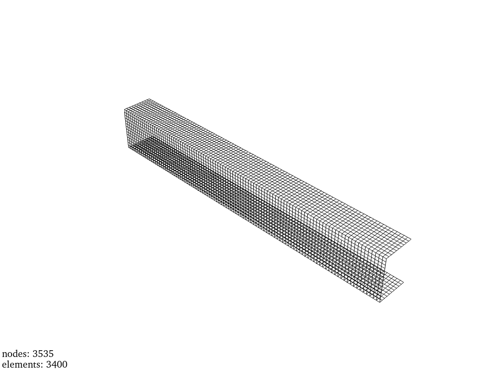
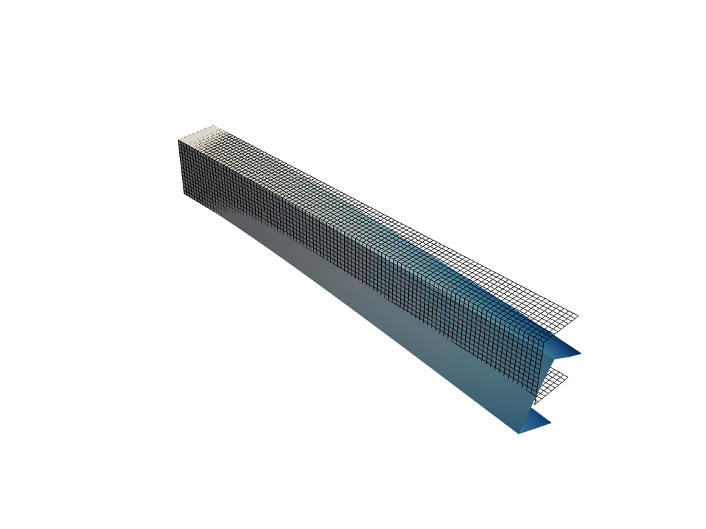

# UProfil.gid
C-channel beam (Ger.: U-Profil) under bending modeled by Erich Wehrle

## Model parameters

### Unit system used
MPa

### Geometry
Length: 100 mm

Height: 14 mm

Width: 10 mm

### Material

Linear elastic

Steel

Young's modulus: 206.9 GPa

Poison's ratio: 0.29

Density: 7.850e^-9 t/mm³

## Boundary conditions

Force: 5000 N

Contraints: Fixed at left end

### Solver settings
Solution type: Linear static

### Model details
Number of nodes: 3535

Number of elements: 3400

Element type: Shell (thin corotational)

Approximate solve time (laptop): <1 s

## Results

